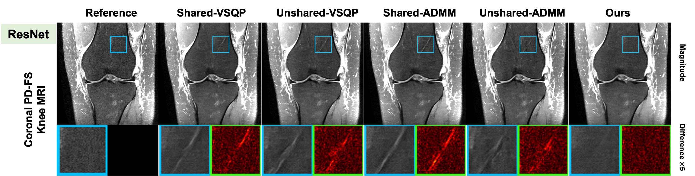

## Time-Embedded Algorithm Unrolling for Computational MRI
[](https://arxiv.org/pdf/2510.16321)
[](https://neurips.cc/virtual/2025/loc/san-diego/poster/119206)

It provides an implementation of the proposed time-embedded algorithm unrolling for MRI reconstruction.


<!--  -->
<p align="center">
  
</p>

---

### 1. Create Conda Environment and Install Requirements

```bash
conda env create -f environment.yml -n {env_name}
conda activate {env_name}

cd TE-Unrolling-MRI
pip install requirement.txt
```

### 2. Run Train / Test Code
```bash
sh task.sh
```
You can configure the number of unrolling steps, acceleration rate, dataset, loss domain, model, and unrolling algorithm in `task.sh`.
The configurations corresponding to the settings reported in the paper are automatically implemented in `configs.py`.
For additional custom configurations or datasets, please modify `configs.py` or `utils.py` accordingly.

### 3. Run Demo Code
We provide a pre-trained ResNet model with our proposed method (PD, R=4, 10unrolls):

```bash
sh demo.sh
```


## 🙏 Acknowledgements
I would like to thank [@Yaşar Utku Alçalar](https://github.com/ualcalar17) for laying the foundation of this code and for his great support.


## 📝 BibTeX
```bibtex

@inproceedings{yun2025timeembedded,
    title={Time-Embedded Algorithm Unrolling for Computational {MRI}},
    author={Junno Yun and Yasar Utku Alcalar and Mehmet Akcakaya},
    booktitle={The Thirty-ninth Annual Conference on Neural Information Processing Systems},
    year={2025},
    url={https://openreview.net/forum?id=DcFoi71Fgf}
    }
```
